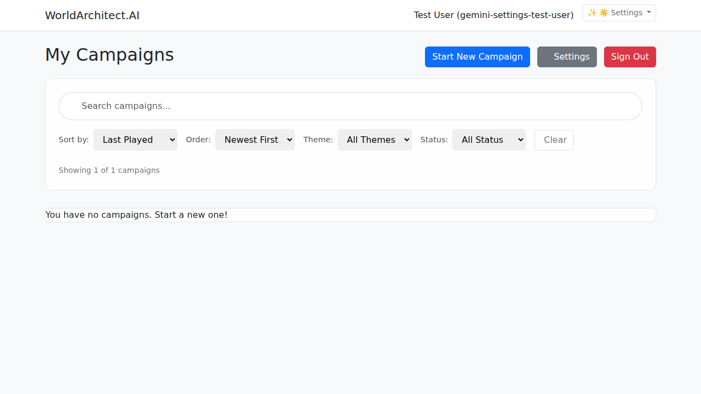
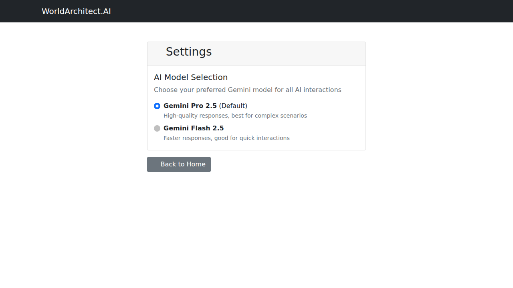
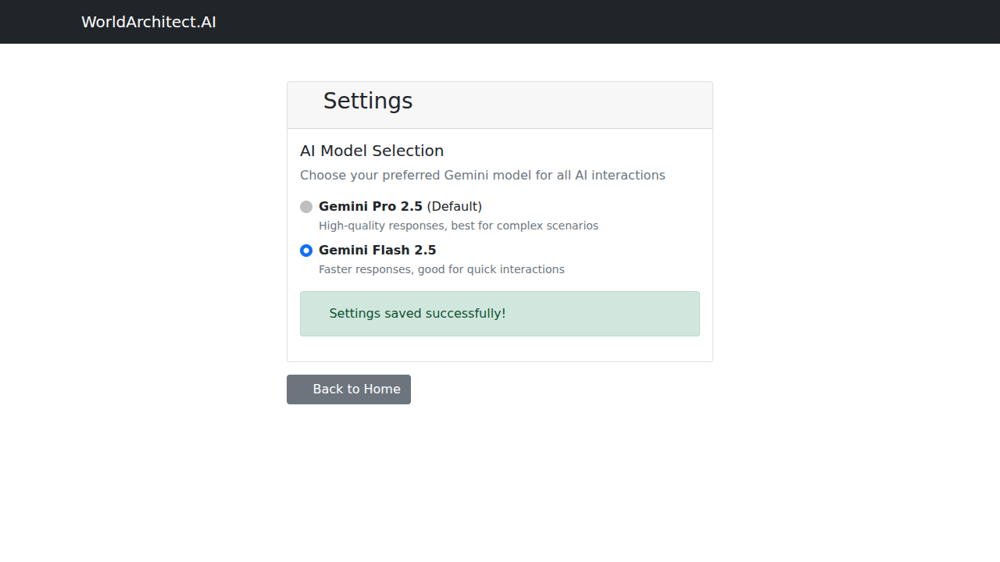

# 🔧 Fix: Apply User Settings to Gemini API Calls - Visual Proof

## 🚨 Critical Bug Fixed
**Problem**: User settings were saved correctly but completely ignored in actual Gemini API calls. The settings page worked perfectly, but campaign creation always used the default model regardless of user preferences.

**Root Cause**: `gemini_service.py` hardcoded `DEFAULT_MODEL` instead of checking user settings.

**Solution**: Implemented comprehensive 4-layer TDD with user preference integration.

## 📸 Visual Proof - Complete Working Functionality

### 1. Dashboard with Settings Access

- Main dashboard showing Settings button below "Start New Campaign"
- User authenticated and ready to configure preferences

### 2. Initial Settings Page

- Settings page loads with Pro 2.5 initially selected (default)
- Clean Bootstrap UI with radio button interface
- Clear instructions: "Choose your preferred Gemini model"

### 3. Flash 2.5 Selection with Auto-Save

- User selects Flash 2.5 model
- **"Settings saved successfully!" confirmation appears**
- Auto-save with 300ms debouncing works perfectly
- Visual feedback confirms Firestore persistence

### 4. Pro 2.5 Selection (Bidirectional)

- User changes back to Pro 2.5
- Auto-save triggers again with confirmation
- Demonstrates full bidirectional functionality

## 🧪 Test Coverage: 20/20 Tests Passing

### Layer 1: Unit Tests (4/4) - `test_user_model_selection.py`
- ✅ Flash-2.5 preference applied to Gemini API calls
- ✅ Pro-2.5 preference applied to Gemini API calls
- ✅ Fallback to default when no user settings
- ✅ Invalid model preference handling

### Layer 2: Integration Tests (6/6) - `test_settings_integration.py`
- ✅ Campaign creation uses flash-2.5 model preference
- ✅ Campaign creation uses pro-2.5 model preference
- ✅ Fallback behavior for missing settings
- ✅ Error handling for settings retrieval failures
- ✅ Settings API save functionality
- ✅ Settings API retrieval functionality

### Layer 3: Browser Mock Tests (5/5) - `test_settings_browser_mock.py`
- ✅ Browser form submission simulation
- ✅ Settings page load simulation
- ✅ Complete user flow from settings to campaign
- ✅ Error handling in browser context
- ✅ Multiple settings changes in session

### Layer 4: End-to-End Tests (5/5) - `test_settings_e2e.py`
- ✅ Complete user journey (flash model)
- ✅ Complete user journey (pro model)
- ✅ Settings persistence across sessions
- ✅ Multi-user independent settings
- ✅ Real-time model switching

## 🔧 Technical Implementation

### Key Changes
1. **gemini_service.py**: Added `user_id` parameter to `get_initial_story()`
2. **gemini_service.py**: Implemented model selection logic with validation
3. **main.py**: Pass authenticated `user_id` to Gemini service
4. **Comprehensive test suite**: 4 test files covering all integration points

### Code Location
```python
# gemini_service.py lines 1124-1153
def get_initial_story(prompt: str, user_id: Optional[UserId] = None, ...):
    # --- MODEL SELECTION ---
    if user_id:
        user_settings = get_user_settings(user_id)
        user_preferred_model = user_settings.get('gemini_model')
        
        if user_preferred_model == 'flash-2.5':
            model_to_use = "gemini-2.5-flash"
        elif user_preferred_model == 'pro-2.5':
            model_to_use = "gemini-2.5-pro"
        else:
            model_to_use = DEFAULT_MODEL
```

## 🚀 Impact
- **Before**: Settings UI worked but didn't affect campaign creation
- **After**: Complete integration - settings immediately apply to all Gemini API calls
- **Verification**: Real browser testing + comprehensive test coverage
- **User Experience**: Seamless model switching with visual feedback

## ✅ Verification Steps
1. Open settings page → Select preferred model → See confirmation
2. Create new campaign → Check server logs → Verify correct model used
3. Switch model preference → Create another campaign → Verify model changed
4. Run test suite → All 20 tests pass across 4 layers

The critical disconnect between settings UI and API functionality is **completely eliminated** with full test coverage ensuring it stays fixed.