# Implementation vs Orchestration Decision Framework

**Purpose**: Prevent fake code creation through systematic decision-making

## 🚪 Pre-Implementation Decision Gate

**MANDATORY QUESTION**: "Can I implement this function fully right now?"

```mermaid
flowchart TD
    A[Need New Functionality] --> B{Can I implement this fully right now?}
    
    B -->|YES| C[✅ IMPLEMENT with working code]
    B -->|NO| D{Does existing command handle this?}
    
    D -->|YES| E[✅ USE ORCHESTRATION - call existing command]
    D -->|NO| F{Can I break into smaller implementable parts?}
    
    F -->|YES| G[✅ IMPLEMENT smaller parts individually]
    F -->|NO| H[❌ DON'T CREATE - document as future need]
    
    C --> I[✅ Working Function Created]
    E --> J[✅ Orchestration Pattern Used]
    G --> K[✅ Incremental Implementation]
    H --> L[✅ No Fake Code Created]
    
    style C fill:#90EE90
    style E fill:#87CEEB  
    style G fill:#90EE90
    style H fill:#FFE4B5
```



## 🎯 Decision Criteria

### ✅ **IMPLEMENT DIRECTLY** when:
- All dependencies available
- Clear, well-defined functionality
- Can write working code immediately
- No existing command handles this need

### ✅ **USE ORCHESTRATION** when:
- Existing command provides functionality (e.g., `/commentfetch`)
- Need to combine multiple existing capabilities
- Can delegate to proven implementations
- Want to avoid duplication

### ❌ **NEVER CREATE PLACEHOLDER** when:
- Missing dependencies or infrastructure
- Unclear requirements or specifications
- Would need to write fake/simulation code
- Planning to "implement later"

## 🛡️ Anti-Fake Code Patterns

**Instead of Creating Fake Code**:

```python
# ❌ DON'T DO THIS (Fake Implementation)
def call_github_mcp(function_name, params):
    # TODO: Implement MCP integration
    # For now, return None
    return None

# ✅ DO THIS (Orchestration)
# In .md file: Call /commentfetch which handles GitHub API
```

**Instead of Placeholder Functions**:

```python
# ❌ DON'T DO THIS (Placeholder)
def complex_algorithm():
    # Will implement sophisticated logic later
    pass

# ✅ DO THIS (Break into implementable parts)
def validate_input(data):
    return isinstance(data, dict) and 'required_field' in data

def process_simple_case(data):
    return data.get('simple_field', 'default')

# Complex algorithm = orchestration of simple parts
```

## 🔄 Orchestration Examples

**Pattern 1: Command Composition**
```markdown
# gstatus.md - Orchestrates existing commands
/commentfetch  # Use existing GitHub integration
python3 .claude/commands/gstatus.py  # Handle display logic
```

**Pattern 2: Utility Function Reuse**
```python
# Use existing utility instead of reimplementing
from existing_module import validated_api_call
result = validated_api_call("github", params)
```

**Pattern 3: Incremental Building**
```python
# Build complex functionality from simple, working parts
def complex_operation(data):
    validated = validate_input(data)  # Working function
    processed = transform_data(validated)  # Working function  
    return format_output(processed)  # Working function
```

## 📊 Success Metrics

- **Zero fake code** in new implementations
- **Higher orchestration ratio** - reusing existing commands
- **Faster development** - no fake code cleanup cycles
- **Better architecture** - composition over duplication

## 🚨 Red Flags (Stop and Reassess)

- Writing TODO comments in function bodies
- Using placeholder return values
- Comments saying "implement later" or "for now"
- Hardcoded None returns with "fallback" comments
- Creating simplified versions of existing functionality

## 💡 Quick Decision Checklist

Before writing any function:

- [ ] Can I implement this completely right now?
- [ ] Does an existing command already handle this?
- [ ] Do I have all required dependencies/APIs?
- [ ] Will this function actually work when called?
- [ ] Am I avoiding duplication of existing logic?

**If any answer is NO → Use orchestration or don't create the function**

---

**Generated**: 2025-08-21 via /execute prevention system implementation
**Reference**: CLAUDE.md Pre-Implementation Decision Framework