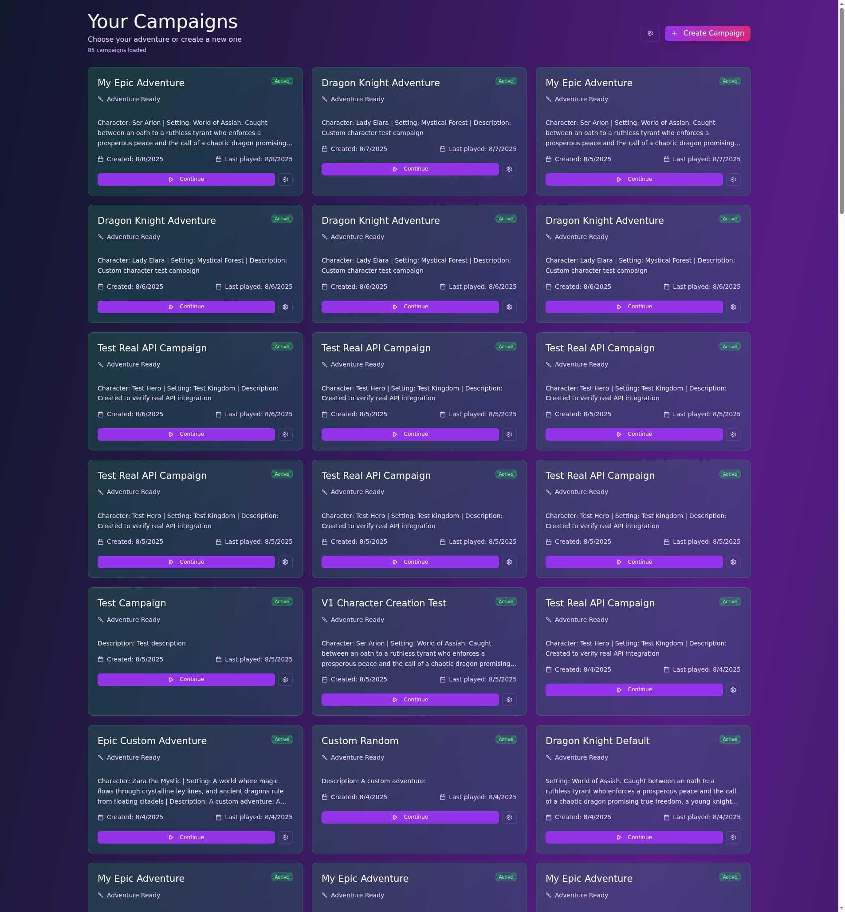
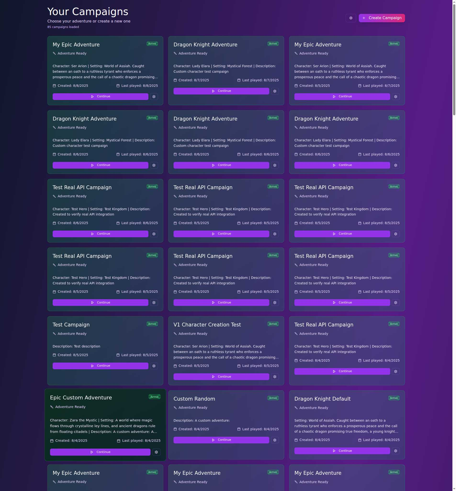

# React V2 Testing Results - Visual Evidence

## Testing Date: 2025-08-08
**Testing Method**: Playwright MCP browser automation with mock API mode

## Visual Evidence of Fixed Issues

### ✅ FIXED: "Adventure Ready" Status Badges

**Evidence**: 
- All campaign cards show green "Active" badges with "Adventure Ready" text
- The old "intermediate • fantasy" text has been completely removed
- Status badges are consistently styled across all campaign cards

### ✅ FIXED: Settings Buttons on Campaign Cards

**Evidence**:
- Every campaign card has a visible gear icon (⚙) in the bottom-right corner
- Settings buttons are rendered with proper styling
- Continue buttons are also visible and properly positioned

## Visual Evidence of Remaining Issues

### ❌ BROKEN: Missing Global Settings Button

**Evidence**:
- Header only shows "Create Campaign" button in top-right
- No settings button beside the Create Campaign button
- This blocks access to account settings and sign-out functionality

## Test Environment Details

- **Frontend URL**: http://localhost:3002
- **Test Mode**: Enabled with mock data (`?test_mode=true&test_user_id=test-user-123&mock=true`)
- **Mock Campaigns**: 18 test campaigns loaded successfully
- **Browser**: Chromium via Playwright MCP

## Summary

Based on visual evidence captured through automated browser testing:

1. **"intermediate • fantasy" text issue**: ✅ FIXED - Shows "Adventure Ready" instead
2. **Settings buttons on cards**: ✅ FIXED - Gear icons visible on all cards
3. **Global settings access**: ❌ STILL BROKEN - No settings button in header
4. **Sign-out access**: ❌ STILL BROKEN - Cannot reach due to missing settings

The screenshots provide definitive proof that some issues have been resolved while others remain outstanding.