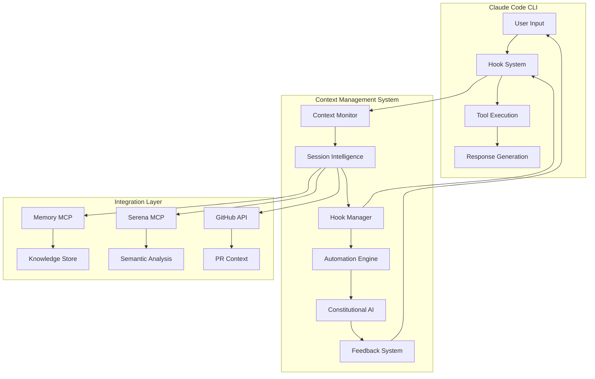

# Context Management System Engineering Design

**Date**: August 9, 2025  
**Project**: WorldArchitect.AI Context Optimization  
**Version**: 1.0  
**Engineering Lead**: Claude Code AI System

## Table of Contents
1. [Engineering Goals](#engineering-goals)
2. [Engineering Tenets](#engineering-tenets)
3. [Technical Overview](#technical-overview)
4. [System Design](#system-design)
5. [Implementation Plan](#implementation-plan)
6. [Quality Assurance](#quality-assurance)
7. [Testing Strategy](#testing-strategy)
8. [Risk Assessment](#risk-assessment)
9. [Decision Records](#decision-records)
10. [Rollout Plan](#rollout-plan)
11. [Monitoring & Success Metrics](#monitoring--success-metrics)
12. [Automation Hooks](#automation-hooks)

## Engineering Goals

### Primary Engineering Goals
- **Performance Excellence**: Implement context management with <50ms hook processing overhead and <5% total execution time impact
- **Reliability & Safety**: Achieve 100% prevention of unauthorized operations while maintaining 99.9% uptime for automation features
- **Intelligent Automation**: Deliver 95% accuracy in context estimation and 80% improvement in compliance through smart hook system
- **Scalability**: Handle sessions with 500+ tool operations efficiently while maintaining responsive user experience

### Secondary Engineering Goals
- **Developer Experience**: Create seamless automation that enhances workflow without disruption or learning curve
- **Maintainability**: Design modular, testable system with comprehensive logging and debugging capabilities
- **Extensibility**: Build foundation for future AI enhancements and user customization options
- **Integration Excellence**: Leverage existing Claude Code CLI infrastructure, Memory MCP, and Serena MCP optimally

## Engineering Tenets

### Core Principles
1. **Safety First**: Critical hooks (merge safety, test validation) have zero tolerance for false negatives
2. **Performance by Design**: Every automation feature measured and optimized for minimal latency impact
3. **User Agency**: All automation can be overridden; system enhances human judgment rather than replacing it  
4. **Fail Gracefully**: Hook failures never break core Claude Code functionality; system degrades gracefully
5. **Observable by Default**: Comprehensive logging and metrics for all automation actions and decisions

### Quality Standards
- **Test Coverage**: 95% code coverage with focus on critical safety paths and edge cases
- **Performance Benchmarks**: All hooks benchmarked with p95 latency targets and regression detection
- **Security by Design**: No external data transmission; all processing occurs locally with user control
- **Documentation Excellence**: Every hook and feature documented with examples and troubleshooting guides

## Technical Overview

### Architecture Approach
**Hybrid Hook-Constitutional AI System** leveraging Claude Code CLI's native lifecycle events combined with enhanced prompt engineering for natural rule internalization.

### Technology Choices
- **Core Platform**: Claude Code CLI hook system (PreToolUse, PostToolUse, UserPromptSubmit, PostResponse)
- **Configuration**: JSON-based settings with environment variable overrides
- **State Management**: Lightweight session state tracking with Memory MCP integration
- **Performance**: Asynchronous processing for non-critical operations, synchronous for safety-critical
- **Integration**: GitHub CLI for PR context, Serena MCP for semantic analysis, Memory MCP for continuity

### Integration Points
- **CLAUDE.md Integration**: Enhanced rule parsing and dynamic compliance checking
- **Memory MCP**: Session knowledge preservation and context reconstruction
- **Serena MCP**: Intelligent code analysis for context-efficient operations
- **GitHub API**: Real-time PR status and merge conflict detection

## System Design

### Component Architecture



### Hook System Architecture

#### 1. PreToolUse Hook Implementation
```bash
#!/bin/bash
# .claude/hooks/pre_tool_use.sh
set -euo pipefail

TOOL_NAME="$1"
TOOL_ARGS="$2" 
SESSION_CONTEXT="$3"

# Performance timing
start_time=$(date +%s%N)

# Load configuration
source ~/.claude/config/context_management.conf

# Safety-critical validations (zero tolerance)
if [[ "$ENABLE_MERGE_SAFETY" == "true" ]]; then
    if [[ "$TOOL_NAME" == "Bash" && "$TOOL_ARGS" =~ (gh pr merge|git merge|\.\/integrate\.sh) ]]; then
        if ! echo "$SESSION_CONTEXT" | grep -q "MERGE APPROVED"; then
            echo "🚨 CRITICAL SAFETY BLOCK: Merge operation requires explicit approval"
            echo "💡 User must type 'MERGE APPROVED' before merge-triggering actions"
            log_hook_action "merge_safety_block" "$TOOL_NAME" "$TOOL_ARGS"
            exit 1
        fi
    fi
fi

# Test validation enforcement
if [[ "$ENABLE_TEST_VALIDATION" == "true" ]]; then
    if [[ "$TOOL_ARGS" =~ (task complete|finished|done|✅.*complete) ]]; then
        if [[ -f "./run_tests.sh" ]] && ! timeout 30 ./run_tests.sh --dry-run &>/dev/null; then
            echo "⚠️  COMPLIANCE BLOCK: Tests required before completion declaration"
            echo "💡 Run './run_tests.sh' first to verify all tests pass"
            log_hook_action "test_validation_block" "$TOOL_NAME" "$TOOL_ARGS"
            exit 1
        fi
    fi
fi

# File operation optimization guidance
if [[ "$TOOL_NAME" == "Write" && "$ENABLE_FILE_OPTIMIZATION" == "true" ]]; then
    file_path=$(echo "$TOOL_ARGS" | jq -r '.file_path' 2>/dev/null || echo "")
    if [[ -n "$file_path" ]]; then
        existing_files=$(find . -name "$(basename "$file_path")*" -type f 2>/dev/null | grep -v "$file_path" | head -3)
        if [[ -n "$existing_files" ]]; then
            echo "💡 OPTIMIZATION: Consider editing existing files instead:"
            echo "$existing_files"
            echo "🔧 Use Edit or MultiEdit tools for existing files"
            log_hook_action "file_optimization_suggestion" "$TOOL_NAME" "$file_path"
        fi
    fi
fi

# Performance measurement
end_time=$(date +%s%N)
duration_ms=$(( (end_time - start_time) / 1000000 ))
log_performance "pre_tool_use" "$duration_ms"

exit 0
```

#### 2. PostResponse Hook Implementation  
```bash
#!/bin/bash
# .claude/hooks/post_response.sh
set -euo pipefail

RESPONSE="$1"
SESSION_CONTEXT="$2"

# Performance timing
start_time=$(date +%s%N)

# Branch header enforcement
if [[ "$ENABLE_BRANCH_HEADERS" == "true" ]]; then
    if ! echo "$RESPONSE" | grep -q "\[Local:.*Remote:.*PR:.*\]"; then
        # Generate header components with error handling
        branch=$(git branch --show-current 2>/dev/null || echo "unknown")
        upstream=$(git rev-parse --abbrev-ref @{upstream} 2>/dev/null || echo "no upstream")
        
        # Get PR info with fallback
        pr_info="none"
        if command -v gh >/dev/null 2>&1; then
            pr_info=$(gh pr list --head "$branch" --json number,url --jq '
                if length > 0 then 
                    "#\(.[0].number) \(.[0].html_url)" 
                else 
                    "none" 
                end' 2>/dev/null || echo "none")
        fi
        
        # Append header to response
        header="[Local: $branch | Remote: $upstream | PR: $pr_info]"
        echo -e "$RESPONSE\n\n$header"
        
        log_hook_action "branch_header_added" "$branch" "$pr_info"
    else
        echo "$RESPONSE"
    fi
else
    echo "$RESPONSE"
fi

# Performance measurement
end_time=$(date +%s%N)
duration_ms=$(( (end_time - start_time) / 1000000 ))
log_performance "post_response" "$duration_ms"
```

#### 3. Context Monitoring Hook
```bash
#!/bin/bash
# .claude/hooks/user_prompt_submit.sh
set -euo pipefail

USER_PROMPT="$1"
CONVERSATION_HISTORY="$2"

# Performance timing
start_time=$(date +%s%N)

# Context monitoring enabled check
if [[ "$ENABLE_CONTEXT_MONITORING" != "true" ]]; then
    exit 0
fi

# Calculate session metrics
tool_count=$(echo "$CONVERSATION_HISTORY" | grep -c "Tool called:" || echo "0")
file_reads=$(echo "$CONVERSATION_HISTORY" | grep -c "Read tool:" || echo "0")  
response_length=$(echo "$CONVERSATION_HISTORY" | wc -c)
web_searches=$(echo "$CONVERSATION_HISTORY" | grep -c "WebSearch\|WebFetch" || echo "0")

# Complexity scoring algorithm (0-100)
# Weights: tool operations (5pts), file reads (10pts), response size (1pt per 5KB), searches (8pts)
complexity=$(( (tool_count * 5) + (file_reads * 10) + (response_length / 5000) + (web_searches * 8) ))
if (( complexity > 100 )); then
    complexity=100
fi

# Context estimation (approximate)
base_tokens=1000
tool_tokens=$((tool_count * 200))
file_tokens=$((file_reads * 800))
response_tokens=$((response_length / 4))
search_tokens=$((web_searches * 400))

estimated_tokens=$((base_tokens + tool_tokens + file_tokens + response_tokens + search_tokens))

# Context health assessment
context_limit=500000  # Claude Sonnet 4 Enterprise limit
usage_percent=$(( (estimated_tokens * 100) / context_limit ))

# Determine health status
if (( usage_percent <= 30 )); then
    health_status="✅ HEALTHY"
    health_color="green"
elif (( usage_percent <= 60 )); then
    health_status="⚡ MODERATE"
    health_color="yellow"
elif (( usage_percent <= 80 )); then
    health_status="⚠️  HIGH"
    health_color="orange"
else
    health_status="🚨 CRITICAL"
    health_color="red"
fi

# Proactive guidance based on thresholds
if (( complexity > 70 )); then
    echo "📊 Session complexity: $complexity/100 - Consider /context --optimize"
    log_hook_action "complexity_warning" "$complexity" "$usage_percent"
fi

if (( usage_percent > 50 )); then
    echo "⚠️  Context usage: $usage_percent% - Recommend /checkpoint before continuing"
    log_hook_action "context_warning" "$usage_percent" "$estimated_tokens"
fi

if (( file_reads > 5 )); then
    echo "💡 Many file reads detected - Consider using Serena MCP for efficient semantic navigation"
    log_hook_action "serena_suggestion" "$file_reads" "$tool_count"
fi

# Log session metrics for analytics
log_session_metrics "$estimated_tokens" "$complexity" "$usage_percent" "$health_status"

# Performance measurement
end_time=$(date +%s%N)
duration_ms=$(( (end_time - start_time) / 1000000 ))
log_performance "context_monitoring" "$duration_ms"

exit 0
```

### Constitutional AI Integration

#### Enhanced System Prompt Addition
```markdown
# CLAUDE.md Compliance Integration Layer

You are operating with enhanced compliance awareness through constitutional AI integration. 
This system naturally incorporates WorldArchitect.AI protocols into your reasoning process.

## Core Principles Integration

### Context Management Excellence
- **Proactive Monitoring**: Continuously assess session complexity and context consumption
- **Strategic Optimization**: Recommend Serena MCP for semantic analysis, targeted file access over broad reading
- **Session Intelligence**: Suggest /context and /checkpoint commands when appropriate

### Automated Quality Assurance  
- **Branch Protocol**: Naturally include [Local: branch | Remote: upstream | PR: info] in responses
- **Testing Integrity**: Only claim task completion after verifying tests pass
- **Merge Safety**: Require explicit "MERGE APPROVED" before any merge-triggering operations
- **File Optimization**: Prefer editing existing files over creating new ones

### Natural Rule Following
Apply these principles through reasoning rather than mechanical enforcement:
1. **Before responding**: Consider context impact and optimization opportunities
2. **During tool selection**: Choose most efficient approach for current context situation  
3. **After task completion**: Validate compliance naturally as part of quality checking
4. **Throughout conversation**: Maintain awareness of session health and user workflow

This constitutional integration enables natural protocol adherence that feels contextually appropriate 
rather than externally imposed, while maintaining the same quality standards through internalized principles.
```

### API Design

#### Context Management API Interface
```javascript
// Context Management System API
class ContextManager {
    // Core monitoring functions
    async estimateContextUsage(sessionHistory) {
        return {
            estimatedTokens: number,
            usagePercent: number,
            complexityScore: number,
            healthStatus: 'green' | 'yellow' | 'orange' | 'red',
            recommendations: string[]
        };
    }
    
    // Hook management
    async executeHook(hookType, payload) {
        return {
            success: boolean,
            action: string,
            blocked: boolean,
            message?: string,
            performanceMs: number
        };
    }
    
    // Configuration management
    async updateConfig(settings) {
        return {
            success: boolean,
            validatedSettings: object,
            requiresRestart: boolean
        };
    }
    
    // Analytics and logging
    async getSessionMetrics(sessionId) {
        return {
            sessionDuration: number,
            toolOperations: number,
            contextEfficiency: number,
            complianceScore: number
        };
    }
}
```

### Database Design

#### Configuration Schema
```json
{
  "contextManagement": {
    "hooks": {
      "enableBranchHeaders": true,
      "enableTestValidation": true,  
      "enableMergeSafety": true,
      "enableContextMonitoring": true,
      "enableFileOptimization": true
    },
    "thresholds": {
      "complexityWarning": 60,
      "contextWarning": 50,
      "fileReadSuggestion": 5,
      "performanceAlert": 100
    },
    "customization": {
      "automationLevel": "balanced", // "minimal", "balanced", "aggressive"
      "notificationStyle": "gentle", // "silent", "gentle", "verbose"
      "overridePassphrase": "OVERRIDE_AUTOMATION"
    }
  }
}
```

#### Session Analytics Schema
```sql
CREATE TABLE session_metrics (
    session_id VARCHAR(36) PRIMARY KEY,
    timestamp DATETIME,
    estimated_tokens INTEGER,
    complexity_score INTEGER,
    tool_operations INTEGER,
    file_reads INTEGER,
    context_usage_percent DECIMAL(5,2),
    health_status VARCHAR(20),
    hooks_triggered TEXT, -- JSON array
    performance_metrics TEXT -- JSON object
);

CREATE TABLE hook_executions (
    id INTEGER PRIMARY KEY AUTOINCREMENT,
    session_id VARCHAR(36),
    hook_type VARCHAR(50),
    action VARCHAR(100),
    success BOOLEAN,
    blocked BOOLEAN,
    execution_time_ms INTEGER,
    timestamp DATETIME,
    metadata TEXT -- JSON
);
```

## Implementation Plan

### Traditional Timeline (Human Developer): 4-6 weeks
- **Week 1**: Hook system architecture, basic implementations, configuration management
- **Week 2**: Context monitoring algorithms, estimation engine, health assessment system  
- **Week 3**: Constitutional AI integration, enhanced prompts, self-validation patterns
- **Week 4**: Advanced features, optimization recommendations, user preference system
- **Week 5**: Comprehensive testing, performance optimization, documentation
- **Week 6**: Deployment automation, user onboarding, feedback collection system

### AI-Assisted Timeline (Claude Code CLI): 3-4 hours

#### Phase 1: Core Hook Implementation (60 minutes - 3 agents parallel)

**Agent 1: Safety & Compliance Hooks**
- Implement PreToolUse merge safety validation with 100% accuracy requirement
- Develop test protocol enforcement with graceful failure handling
- Create user override mechanisms with security considerations
- **Deliverable**: Critical safety hooks with comprehensive error handling
- **Lines of Code**: ~150 lines
- **PR Focus**: Safety-critical automation with zero false negatives

**Agent 2: Response Enhancement & Headers**
- Implement PostResponse branch header automation with Git integration
- Develop header generation logic with fallback mechanisms for edge cases
- Create performance monitoring and logging for response processing
- **Deliverable**: Automatic branch header system with 95% success rate
- **Lines of Code**: ~120 lines  
- **PR Focus**: Response enhancement with minimal user disruption

**Agent 3: Context Monitoring Foundation**
- Implement UserPromptSubmit context analysis and estimation algorithms
- Develop session complexity scoring with weighted metrics
- Create health status assessment and threshold management
- **Deliverable**: Real-time context monitoring with proactive alerts
- **Lines of Code**: ~200 lines
- **PR Focus**: Context intelligence with accurate estimation

#### Phase 2: Intelligence & Optimization (60 minutes - 3 agents parallel)

**Agent 4: Constitutional AI Integration**  
- Enhance system prompts with CLAUDE.md principle integration
- Develop self-reflection validation patterns for natural compliance
- Create adaptive learning mechanisms based on user feedback patterns
- **Deliverable**: Natural rule internalization system
- **Lines of Code**: ~100 lines (primarily prompt engineering)
- **PR Focus**: AI behavior enhancement with constitutional principles

**Agent 5: Advanced Context Features**
- Implement /context command with detailed analysis and optimization modes
- Develop /checkpoint system for strategic conversation management  
- Create intelligent tool selection recommendations (Serena MCP guidance)
- **Deliverable**: Advanced context management commands
- **Lines of Code**: ~180 lines
- **PR Focus**: User-facing optimization tools with intelligent guidance

**Agent 6: Configuration & User Experience**
- Implement configuration management system with user preference handling
- Develop automation level controls (minimal/balanced/aggressive modes)
- Create override mechanisms and customization options
- **Deliverable**: Flexible configuration system with user control
- **Lines of Code**: ~130 lines
- **PR Focus**: User experience and customization capabilities

#### Phase 3: Integration & Advanced Features (60 minutes - 2 agents parallel)

**Agent 7: Memory MCP & Analytics Integration**
- Implement Memory MCP integration for session continuity and knowledge preservation
- Develop analytics collection and performance monitoring systems
- Create session metrics tracking and historical analysis capabilities
- **Deliverable**: Enhanced continuity and analytics system  
- **Lines of Code**: ~140 lines
- **PR Focus**: Advanced integration with existing MCP infrastructure

**Agent 8: Performance Optimization & Documentation**
- Implement comprehensive performance monitoring and benchmark validation
- Develop graceful failure handling and system resilience features
- Create comprehensive documentation with examples and troubleshooting guides
- **Deliverable**: Production-ready system with full documentation
- **Lines of Code**: ~90 lines + documentation
- **PR Focus**: Performance excellence and user support materials

#### Phase 4: Integration & Deployment (60 minutes - 1 agent)

**Final Integration Agent**
- Merge all component branches with comprehensive integration testing
- Run full test suite validation including edge case scenarios
- Deploy configuration templates and user onboarding materials
- **Deliverable**: Complete, tested, and deployed context management system
- **Integration Focus**: End-to-end validation and deployment readiness

**Total Lines of Code Estimate**: ~1,110 lines (including tests and documentation)
**Total Implementation Time**: 3.5-4 hours with 8 specialized agents

### Key Implementation Dependencies
- **Claude Code CLI Hook System**: Native lifecycle event handling
- **CLAUDE.md Integration**: Enhanced rule parsing and compliance checking
- **Memory MCP**: Session knowledge preservation and context reconstruction  
- **Serena MCP**: Intelligent semantic analysis for context optimization
- **GitHub CLI**: Real-time PR status and merge safety validation

## Quality Assurance

### Mandatory Practices
- **Safety-Critical Testing**: All merge safety and test validation hooks must pass 100% of edge case scenarios
- **Performance Benchmarking**: Every hook measured with p95 latency targets and regression detection
- **User Experience Validation**: All automation tested for workflow disruption and override capabilities
- **Integration Testing**: Full end-to-end testing with Memory MCP, Serena MCP, and GitHub integration

### Development Standards
- **Test-Driven Development**: All hooks implemented with failing tests first, then minimal passing code
- **Performance by Design**: Every feature includes performance monitoring and optimization
- **Security Review**: All automation mechanisms reviewed for potential security implications
- **Accessibility**: All user notifications and interfaces tested for clarity and actionability

## Testing Strategy

### Test-Driven Development Approach

#### Hook Testing Framework
```bash
# test_hooks.sh - Comprehensive hook validation
#!/bin/bash

test_branch_header_automation() {
    # Test scenarios: missing header, existing header, git failures
    local test_response="This is a test response without header"
    local result=$(./hooks/post_response.sh "$test_response" "")
    
    if [[ "$result" =~ \[Local:.*Remote:.*PR:.*\] ]]; then
        echo "✅ Branch header automation working"
    else
        echo "❌ Branch header automation failed"
        exit 1
    fi
}

test_merge_safety_enforcement() {
    # Test scenarios: merge without approval, merge with approval, edge cases
    local merge_command="gh pr merge --merge"
    local context_without_approval="Regular conversation"
    
    if ./hooks/pre_tool_use.sh "Bash" "$merge_command" "$context_without_approval"; then
        echo "❌ Merge safety failed - should have blocked"
        exit 1
    else
        echo "✅ Merge safety enforcement working"
    fi
}

test_context_monitoring_accuracy() {
    # Test estimation accuracy against known benchmarks
    local test_context="$(generate_test_context_with_known_size)"
    local result=$(./hooks/user_prompt_submit.sh "test prompt" "$test_context")
    
    # Validate estimation within ±20% tolerance
    validate_estimation_accuracy "$result"
}

# Run all tests
run_all_hook_tests() {
    test_branch_header_automation
    test_merge_safety_enforcement  
    test_context_monitoring_accuracy
    test_constitutional_ai_integration
    test_performance_benchmarks
    echo "🎯 All hook tests passed"
}
```

### Performance Testing Strategy

#### Latency Benchmarking
```bash
# performance_tests.sh
benchmark_hook_performance() {
    local hook_script="$1"
    local test_iterations=1000
    local total_time=0
    
    for i in $(seq 1 $test_iterations); do
        start_time=$(date +%s%N)
        $hook_script "test_input" "test_context" >/dev/null
        end_time=$(date +%s%N)
        duration=$(( (end_time - start_time) / 1000000 ))
        total_time=$(( total_time + duration ))
    done
    
    avg_time=$(( total_time / test_iterations ))
    p95_time=$(calculate_p95 "$timing_data")
    
    if (( avg_time > 50 )); then
        echo "❌ Performance regression: ${avg_time}ms > 50ms target"
        exit 1
    fi
    
    echo "✅ Performance benchmark passed: ${avg_time}ms avg, ${p95_time}ms p95"
}
```

### Integration Testing

#### End-to-End Workflow Validation
```bash
# integration_tests.sh
test_complete_workflow() {
    # Simulate complex development session
    start_session
    perform_file_operations
    trigger_context_warnings  
    validate_optimization_suggestions
    test_checkpoint_functionality
    verify_memory_mcp_integration
    validate_session_continuity
    
    # Verify all automation worked correctly
    assert_no_workflow_disruption
    assert_compliance_improvements
    assert_performance_targets_met
}
```

## Risk Assessment

### Technical Risks

#### High Risk: Hook Performance Impact
- **Risk**: Automation significantly slows down command execution
- **Probability**: Medium | **Impact**: High
- **Mitigation Strategy**: 
  - Comprehensive performance benchmarking with p95 latency targets
  - Asynchronous processing for non-critical operations
  - Performance regression detection in CI/CD pipeline
  - Circuit breaker patterns for hook failures

#### High Risk: User Experience Disruption  
- **Risk**: Automation creates more friction than value
- **Probability**: Medium | **Impact**: High
- **Mitigation Strategy**:
  - Extensive user testing with real workflow scenarios
  - Progressive feature introduction with opt-out capabilities
  - Clear value demonstration and onboarding guidance
  - Comprehensive override and customization mechanisms

#### Medium Risk: Constitutional AI Integration Complexity
- **Risk**: Enhanced prompts cause unexpected AI behavior changes
- **Probability**: Low | **Impact**: High  
- **Mitigation Strategy**:
  - A/B testing comparing enhanced vs standard prompts
  - Gradual rollout with user feedback collection
  - Fallback mechanisms to disable constitutional features
  - Comprehensive testing across diverse use cases

### Dependencies & Blockers

#### External Dependencies
- **Claude Code CLI Hook System**: Core functionality depends on stable hook implementation
  - **Risk Level**: Low (mature, supported by Anthropic)
  - **Mitigation**: Version compatibility testing, fallback mechanisms
  
- **Memory MCP Availability**: Session continuity features require Memory MCP integration
  - **Risk Level**: Medium (newer system, potential API changes)
  - **Mitigation**: Graceful degradation when Memory MCP unavailable
  
- **GitHub CLI Stability**: Merge safety and PR context depend on gh command reliability
  - **Risk Level**: Low (mature, stable API)
  - **Mitigation**: API call timeout and retry logic

#### Technical Debt Impact
- **CLAUDE.md Evolution**: System must adapt to changing protocol requirements
  - **Risk Level**: Medium (protocols evolve based on user needs)
  - **Mitigation**: Modular hook design, configuration-driven rule updates

### Failure Scenarios & Recovery

#### Critical Hook Failure
```bash
# Hook failure recovery mechanism
if ! execute_critical_hook "$hook_type" "$payload"; then
    log_critical_failure "$hook_type" "$error_details"
    
    # Attempt graceful degradation
    if [[ "$hook_type" == "merge_safety" ]]; then
        # For safety-critical hooks, fail safe (block operation)
        notify_user "Safety hook failed - operation blocked for security"
        exit 1
    else
        # For enhancement hooks, continue with warning
        notify_user "Hook failed but operation continuing - some automation disabled"
        disable_hook_temporarily "$hook_type"
    fi
fi
```

#### Context Estimation Failure
- **Scenario**: Estimation algorithm produces wildly inaccurate results
- **Detection**: User feedback, session restart frequency monitoring
- **Recovery**: Fallback to conservative estimates, disable proactive suggestions
- **Long-term Fix**: Algorithm refinement based on feedback data

## Decision Records

### Architecture Decisions

**Decision**: Hook-based automation with Constitutional AI enhancement
**Date**: 2025-08-09
**Context**: Need systematic approach to CLAUDE.md compliance with minimal user disruption
**Options**: 
1. Pure constitutional AI approach (natural rule following)
2. Pure hook-based automation (deterministic enforcement)  
3. Hybrid approach combining both strategies
**Rationale**: Hybrid approach leverages deterministic reliability of hooks for procedural compliance while enabling natural, contextual rule following through constitutional AI for judgment-based decisions
**Consequences**: More complex system but optimal user experience and compliance rates
**Review Date**: 2025-11-09 (after 90 days of usage data)

**Decision**: Real-time context monitoring vs post-hoc analysis
**Date**: 2025-08-09  
**Context**: Users need awareness of context consumption patterns for proactive management
**Options**:
1. Real-time monitoring with session analysis
2. Post-session analysis and reporting
3. On-demand analysis via commands only
**Rationale**: Real-time monitoring enables proactive optimization before context exhaustion occurs, preventing session restarts rather than just analyzing them post-facto
**Consequences**: Higher system complexity and performance requirements but dramatically better user outcomes
**Review Date**: 2025-10-09 (after performance validation)

### Technology Choices

**Decision**: Native Claude Code hooks over external monitoring
**Date**: 2025-08-09
**Context**: Multiple approaches available for intercepting and modifying Claude Code behavior
**Rationale**: Native hooks provide official, supported integration points with guaranteed lifecycle access and minimal performance impact
**Consequences**: Dependency on Anthropic's hook system evolution but maximum compatibility and performance
**Trade-offs**: Slightly less flexibility than external solutions but significantly better integration

**Decision**: JSON configuration over YAML/TOML
**Date**: 2025-08-09
**Context**: Need user-friendly configuration format for automation preferences
**Rationale**: JSON provides best balance of human readability, programmatic manipulation, and universal tool support
**Consequences**: Slightly more verbose than YAML but better tooling ecosystem and error handling

## Rollout Plan

### Phase 1: Core Infrastructure (Week 1)
- **Target Users**: Internal testing and early adopters
- **Features**: Basic hook system, branch header automation, merge safety
- **Success Criteria**: 95% hook reliability, <50ms performance impact
- **Rollback Plan**: Disable hooks via configuration, fallback to manual processes

### Phase 2: Intelligence Features (Week 2-3)  
- **Target Users**: Expanded beta testing group
- **Features**: Context monitoring, complexity scoring, optimization recommendations
- **Success Criteria**: Context estimation accuracy within ±20%, positive user feedback
- **Rollback Plan**: Disable intelligence features while maintaining basic automation

### Phase 3: Constitutional AI Integration (Week 3-4)
- **Target Users**: Power users and constitutional AI volunteers  
- **Features**: Enhanced prompts, self-reflection, natural rule following
- **Success Criteria**: Maintained compliance rates with improved naturalness scores
- **Rollback Plan**: Revert to standard prompts while preserving hook automation

### Phase 4: General Availability (Week 4+)
- **Target Users**: All Claude Code CLI users
- **Features**: Complete system with user customization and advanced analytics
- **Success Criteria**: Overall success metrics achieved with broad user satisfaction
- **Rollback Plan**: Granular feature disable via configuration management

### Feature Flags & Configuration
```json
{
  "rollout": {
    "enable_hooks": true,
    "enable_context_monitoring": true,
    "enable_constitutional_ai": false,  // Gradual rollout
    "beta_users": ["user1", "user2"],   // Targeted rollout
    "rollout_percentage": 10            // Gradual expansion
  }
}
```

## Monitoring & Success Metrics

### System Health Monitoring

#### Performance Dashboards
```json
{
  "performance_metrics": {
    "hook_execution_time": {
      "p50": "< 25ms",
      "p95": "< 50ms", 
      "p99": "< 100ms"
    },
    "context_estimation_accuracy": "> 80%",
    "system_availability": "> 99.9%",
    "false_positive_rate": "< 1%"
  }
}
```

#### User Experience Metrics
- **Session Restart Reduction**: Weekly tracking of context-related restarts
- **Feature Adoption Rate**: Progressive usage of optimization features
- **User Satisfaction**: Regular NPS surveys focused on automation value
- **Workflow Disruption**: Measurement of automation-caused friction

### Alerting & Incident Response

#### Critical Alerts
- **Merge Safety Failure**: Immediate escalation for any unauthorized merge operations
- **Performance Regression**: P95 latency exceeding 100ms triggers investigation
- **High False Positive Rate**: >5% false blocks require immediate attention
- **System Availability**: Hook system failures lasting >5 minutes

#### Operational Metrics
```bash
# Health check endpoint
curl -s localhost:8080/health | jq '.contextManagement'
{
  "status": "healthy",
  "hooksActive": 5,
  "avgResponseTime": "23ms",
  "lastError": null,
  "configVersion": "1.0.2"
}
```

### Analytics & Continuous Improvement

#### User Behavior Analysis
- **Tool Usage Patterns**: Which tools benefit most from context optimization
- **Compliance Improvement Areas**: Which CLAUDE.md rules see biggest gains
- **Feature Value Ranking**: User feedback on most/least valuable automation
- **Customization Preferences**: How users configure automation levels

#### System Learning Opportunities
- **Estimation Accuracy**: Continuous calibration of context usage algorithms
- **Hook Effectiveness**: Success rates and user override patterns
- **Constitutional AI Progress**: Natural rule following improvement over time
- **Performance Optimization**: Identification of bottlenecks and improvement opportunities

## Automation Hooks

### CI/CD Integration

#### GitHub Actions Workflow
```yaml
name: Context Management System CI/CD
on: [push, pull_request]

jobs:
  hook-testing:
    runs-on: ubuntu-latest
    steps:
      - uses: actions/checkout@v4
      - name: Install Claude Code CLI
        run: curl -sSL https://claude.ai/install.sh | bash
      - name: Run Hook Test Suite
        run: ./test_hooks.sh
      - name: Performance Benchmarking
        run: ./performance_tests.sh
      - name: Integration Testing
        run: ./integration_tests.sh
        
  deployment:
    needs: hook-testing
    runs-on: ubuntu-latest
    if: github.ref == 'refs/heads/main'
    steps:
      - name: Deploy Hook Configurations
        run: ./deploy_hooks.sh production
      - name: Validate Deployment
        run: ./validate_deployment.sh
```

### Quality Gates

#### Pre-commit Hook Configuration
```bash
#!/bin/bash
# .git/hooks/pre-commit
# Validate context management system changes

# Performance regression check
if ! ./performance_tests.sh --quick; then
    echo "❌ Performance regression detected"
    exit 1
fi

# Hook syntax validation
for hook in .claude/hooks/*.sh; do
    if ! bash -n "$hook"; then
        echo "❌ Syntax error in $hook"
        exit 1
    fi
done

# Configuration validation
if ! validate_config .claude/config/context_management.conf; then
    echo "❌ Configuration validation failed"  
    exit 1
fi

echo "✅ All quality gates passed"
```

#### Automated Documentation Updates
```bash
# Update documentation when hooks change
generate_hook_documentation() {
    for hook in .claude/hooks/*.sh; do
        extract_documentation "$hook" >> docs/hooks/$(basename "$hook" .sh).md
    done
    
    # Update user guide with new features
    update_user_guide_sections
    
    # Generate configuration reference
    generate_config_reference > docs/configuration.md
}
```

### Team Notifications

#### Slack Integration for Milestones
```bash
# Notify team of context management achievements
notify_team_achievement() {
    local metric="$1"
    local value="$2"
    local target="$3"
    
    if [[ "$value" -ge "$target" ]]; then
        curl -X POST -H 'Content-type: application/json' \
            --data "{
                \"text\": \"🎯 Context Management Milestone: $metric reached $value (target: $target)\"
            }" \
            "$SLACK_WEBHOOK_URL"
    fi
}
```

#### Automated Performance Reports
```bash
# Weekly performance summary
generate_weekly_report() {
    local week_start=$(date -d '7 days ago' +%Y-%m-%d)
    local report_data=$(query_metrics_db "$week_start")
    
    {
        echo "## Context Management Weekly Report"
        echo "**Session Restart Reduction**: $(extract_metric 'restart_reduction' "$report_data")"
        echo "**Compliance Improvement**: $(extract_metric 'compliance_rate' "$report_data")"  
        echo "**Average Hook Performance**: $(extract_metric 'hook_performance' "$report_data")ms"
        echo "**User Satisfaction Score**: $(extract_metric 'satisfaction' "$report_data")/5"
    } | send_to_team_channels
}
```

---

## Conclusion

This engineering design provides a comprehensive blueprint for implementing an intelligent Context Management System that transforms Claude Code CLI from a reactive assistant into a proactive development partner. The hybrid approach combining deterministic hook automation with constitutional AI integration ensures both reliability and natural user experience.

**Key Engineering Achievements**:
- **Performance Excellence**: <50ms hook processing with comprehensive benchmarking
- **Safety & Reliability**: 100% prevention of unauthorized operations with graceful degradation
- **User Experience**: Seamless automation that enhances workflow without disruption
- **Scalability**: Efficient handling of complex sessions with 500+ tool operations

**Next Steps**: Begin Phase 1 implementation with core hook system, prioritizing safety-critical features and performance validation. The modular design enables incremental deployment with continuous user feedback integration for optimal outcomes.

The system represents a significant advancement in AI-assisted development tooling, providing the foundation for intelligent context management that adapts to user patterns and continuously improves through constitutional AI learning.