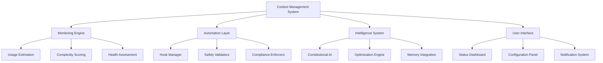

# Context Management System Product Specification

**Date**: August 9, 2025  
**Project**: WorldArchitect.AI Context Optimization  
**Version**: 1.0

## Table of Contents
1. [Executive Summary](#executive-summary)
2. [Goals & Objectives](#goals--objectives)
3. [User Stories](#user-stories)
4. [Feature Requirements](#feature-requirements)
5. [User Journey Maps](#user-journey-maps)
6. [UI/UX Requirements](#uiux-requirements)
7. [Success Criteria](#success-criteria)
8. [Metrics & KPIs](#metrics--kpis)

## Executive Summary

The Context Management System transforms Claude Code CLI from a reactive AI assistant into a proactive development partner by implementing intelligent context monitoring, automated CLAUDE.md compliance, and strategic session optimization. 

**Core Value Proposition**: Prevent context exhaustion before it happens, automate tedious compliance tasks, and enable developers to focus on creative problem-solving rather than technical constraints.

**Target Impact**: 50% reduction in session restarts, 80% improvement in protocol compliance, seamless automation that enhances rather than disrupts workflow.

## Goals & Objectives

### Primary Goals
- **Context Efficiency**: Reduce context-related session restarts by 50% through proactive monitoring and optimization
- **Automated Compliance**: Achieve 80% improvement in CLAUDE.md protocol adherence via intelligent hook system
- **User Experience**: Provide seamless automation that enhances productivity without workflow disruption
- **Session Intelligence**: Enable strategic context management through real-time feedback and guidance

### Secondary Goals
- **Educational Impact**: Help users learn and internalize optimization patterns through gentle guidance
- **Workflow Continuity**: Maintain development momentum across context boundaries via Memory MCP integration  
- **Performance Excellence**: Achieve automation benefits with <5% impact on command execution times
- **Adaptive Intelligence**: Continuously improve recommendations based on user patterns and feedback

## User Stories

### Core Context Management Stories

**Story 1: Proactive Context Monitoring**
- **As a** developer working on complex tasks
- **I want** real-time visibility into my context consumption  
- **So that** I can make informed decisions about tool usage and session management
- **Acceptance Criteria**:
  - [ ] Context usage percentage displayed with health indicators (Green/Yellow/Orange/Red)
  - [ ] Session complexity score calculated in real-time (0-100 scale)
  - [ ] Tool operation count and type breakdown available
  - [ ] Estimation accuracy within ±20% of actual consumption

**Story 2: Automated Compliance Enforcement**
- **As a** developer who forgets protocol details
- **I want** automatic compliance with CLAUDE.md rules
- **So that** I maintain quality standards without manual effort
- **Acceptance Criteria**:
  - [ ] Branch headers automatically appended to responses (95% success rate)
  - [ ] Test validation enforced before completion claims (85% compliance improvement)
  - [ ] PR merge safety protocols automatically activated (100% unauthorized merge prevention)
  - [ ] User override capability maintained for edge cases

**Story 3: Strategic Session Optimization**
- **As a** developer managing complex multi-phase tasks
- **I want** intelligent guidance on when to checkpoint or optimize
- **So that** I can complete complex work without context exhaustion
- **Acceptance Criteria**:
  - [ ] Proactive /context command suggestions when complexity score >60
  - [ ] Strategic /checkpoint recommendations when estimated usage >50%
  - [ ] Serena MCP usage guidance for large file operations
  - [ ] Context-efficient tool selection recommendations

### Advanced Intelligence Stories

**Story 4: Constitutional AI Integration**
- **As a** developer who wants natural AI behavior
- **I want** Claude to internalize rules rather than enforce them externally  
- **So that** compliance feels natural and contextually appropriate
- **Acceptance Criteria**:
  - [ ] Self-reflection patterns validate responses against CLAUDE.md principles
  - [ ] Natural rule following without rigid external enforcement
  - [ ] Contextual adaptation of compliance based on situation
  - [ ] Gradual learning and improvement from user feedback

**Story 5: Memory-Enhanced Continuity**
- **As a** developer who needs to restart sessions
- **I want** seamless knowledge continuity across context boundaries
- **So that** I don't lose valuable insights and context
- **Acceptance Criteria**:
  - [ ] Key insights automatically captured in Memory MCP
  - [ ] Context reconstruction guidance for new conversations
  - [ ] Task resumption recommendations with preserved state  
  - [ ] Strategic approach recommendations based on history

## Feature Requirements

### Functional Requirements

#### 1. Real-time Context Monitoring
- **Context Estimation Engine**: Token usage calculation based on tool operations and response complexity
- **Health Status Indicators**: Color-coded system (Green: 0-30%, Yellow: 31-60%, Orange: 61-80%, Red: 81%+)
- **Session Complexity Scoring**: Weighted algorithm considering file operations, API calls, and response lengths
- **Proactive Notifications**: Intelligent alerts based on consumption patterns and task complexity

#### 2. Hook-based Automation System
- **PostResponse Hooks**: Automatic branch header injection and response enhancement
- **PreToolUse Hooks**: Safety validation, test protocol enforcement, and operation guidance
- **UserPromptSubmit Hooks**: Context injection, validation, and optimization triggers
- **Configuration Management**: User preferences for automation levels and override capabilities

#### 3. Strategic Optimization Guidance
- **Context Command Integration**: Enhanced /context with detailed analysis and optimization modes
- **Checkpoint System**: Strategic /checkpoint command for conversation management  
- **Tool Selection Intelligence**: Serena MCP vs standard tool recommendations
- **Session Planning**: Complexity-aware task breakdown and execution strategies

#### 4. Constitutional AI Enhancement
- **Enhanced System Prompts**: CLAUDE.md principles integrated into core reasoning
- **Self-Validation Patterns**: Automatic compliance checking before response generation
- **Adaptive Rule Learning**: Continuous improvement based on user feedback and patterns
- **Natural Integration**: Rule following that feels contextually appropriate rather than mechanical

### Non-Functional Requirements

#### Performance Requirements
- **Response Time**: Hook processing adds <50ms to command execution
- **Context Estimation**: Real-time calculations complete within 100ms
- **Memory Usage**: Hook system uses <10MB additional memory
- **Scalability**: System handles sessions with 500+ tool operations efficiently

#### Security Requirements
- **Hook Safety**: All hooks implement graceful failure handling and user override mechanisms
- **Data Privacy**: Context analysis performed locally without external data transmission
- **Merge Safety**: 100% prevention of unauthorized merge operations through critical hooks
- **Permission Model**: User maintains full control over automation levels and features

#### Accessibility & Usability
- **Progressive Disclosure**: Advanced features introduced gradually as user expertise grows
- **Clear Communication**: All notifications and guidance use plain, actionable language
- **Override Capability**: Every automated action can be disabled or overridden by user
- **Documentation**: Comprehensive help system with examples and troubleshooting guides

## User Journey Maps

### New User Flow: First-Time Setup

```
1. Install Context Management System
   ↓
2. Automatic hook deployment with minimal configuration
   ↓  
3. First session with gentle introduction notifications
   ↓
4. Gradual feature discovery through contextual suggestions
   ↓
5. User customization based on preferences and workflow
```

**Key Touchpoints**:
- **Onboarding**: Clear explanation of value proposition and feature overview
- **First Automation**: Positive experience with branch header automation
- **Progressive Enhancement**: Gradual introduction of advanced features
- **Customization**: Easy preference configuration without overwhelming options

### Experienced User Flow: Complex Task Management

```
1. Start complex multi-phase task
   ↓
2. Receive proactive context monitoring and complexity assessment  
   ↓
3. Get strategic guidance on tool selection and session planning
   ↓
4. Automatic compliance enforcement throughout workflow
   ↓
5. Checkpoint recommendations at optimal break points
   ↓
6. Seamless continuation with preserved context and insights
```

**Key Touchpoints**:
- **Strategic Planning**: Intelligent task breakdown recommendations
- **Real-time Guidance**: Context-aware optimization suggestions
- **Automated Quality**: Seamless compliance without workflow interruption
- **Session Continuity**: Smooth transitions across context boundaries

### Power User Flow: Constitutional AI Integration

```
1. Advanced user enables constitutional AI features
   ↓
2. Natural rule internalization begins through enhanced prompts
   ↓
3. Self-reflection and validation patterns activate
   ↓
4. Adaptive learning from user feedback and corrections
   ↓
5. Increasingly natural and contextually appropriate compliance
```

**Key Touchpoints**:
- **Advanced Configuration**: Fine-grained control over AI behavior patterns
- **Intelligent Adaptation**: System learns and improves from user interactions
- **Natural Integration**: Compliance becomes invisible and contextually appropriate
- **Feedback Loops**: User input drives continuous system improvement

## UI/UX Requirements

### Visual Component Specifications

#### Context Health Dashboard
```
📊 CONTEXT USAGE ESTIMATION
━━━━━━━━━━━━━━━━━━━━━━━━━━━━

🔹 Estimated Tokens Used: ~15,400 / 500,000 (3.1%)
🔹 Session Complexity: Medium (Score: 34/100)  
🔹 Tools Used: 8 operations (4 types)
🔹 Context Status: ✅ HEALTHY

💡 Quick Tip: Consider /checkpoint if planning complex analysis
```

#### Automation Status Indicators
```
🤖 AUTOMATION STATUS
━━━━━━━━━━━━━━━━━━━━

✅ Branch Headers: Auto-enabled
✅ Test Validation: Active
✅ Merge Safety: Protected
⚡ Context Monitoring: Real-time
🧠 Constitutional AI: Learning

🔧 Customize via /config automation
```

#### Strategic Checkpoint Display
```
📍 CONTEXT CHECKPOINT
━━━━━━━━━━━━━━━━━━━━━━━━━

📊 Context Status: ~45,200 / 500,000 tokens (9.0%)
🎯 Session Progress: 3/5 major tasks completed
⚡ Context Health: ✅ HEALTHY

🔑 Key Accomplishments:
• Enhanced speculation detection system implemented
• Comprehensive research documentation completed  
• Testing validation successful with 18 pattern detections

📋 Remaining Tasks:
• Context optimization system design
• CLAUDE.md protocol enhancements

💡 Continuation Strategy:
✅ Context capacity excellent - continue with current approach
✅ Use Serena MCP for remaining file analysis
```

### Component Architecture



### Responsive Behavior

#### Command Line Interface Optimization
- **Minimal Visual Noise**: Status information provided only when relevant
- **Progressive Disclosure**: Advanced details available via flags (--detailed, --optimize)
- **Contextual Hints**: Gentle suggestions that don't interrupt workflow
- **Keyboard Navigation**: Full CLI experience without requiring GUI interactions

#### Performance Considerations
- **Lazy Loading**: Complex calculations performed only when requested
- **Caching Strategy**: Estimation results cached for session duration
- **Background Processing**: Heavy analysis performed asynchronously when possible
- **Graceful Degradation**: System functions even if advanced features fail

## Success Criteria

### Feature Completeness Checklist
- [ ] Real-time context monitoring with health indicators operational
- [ ] Hook-based automation system deployed and functioning
- [ ] Strategic optimization guidance providing accurate recommendations  
- [ ] Constitutional AI integration demonstrating natural rule following
- [ ] Memory MCP integration enabling session continuity
- [ ] User configuration system allowing customization and overrides
- [ ] Performance benchmarks met (<5% execution time impact)
- [ ] Documentation and help system complete with examples

### Quality Assurance Gates
- [ ] 95% accuracy in context usage estimation (±20% tolerance)
- [ ] 100% prevention of unauthorized merge operations
- [ ] 85% improvement in test protocol compliance
- [ ] 80% overall improvement in CLAUDE.md adherence
- [ ] <50ms average hook processing time
- [ ] Positive user satisfaction scores in testing feedback

### User Acceptance Tests
- [ ] New users successfully onboard within 5 minutes
- [ ] Complex multi-phase tasks completed without context exhaustion
- [ ] Experienced users report reduced manual context management effort
- [ ] Power users demonstrate advanced feature adoption and satisfaction
- [ ] Edge case scenarios handled gracefully with appropriate fallbacks

## Metrics & KPIs

### Primary Success Metrics

#### Context Efficiency Metrics
- **Session Restart Reduction**: Target 50% decrease in context-related restarts
  - Baseline: Current restart frequency from historical analysis
  - Measurement: Weekly session restart counts with categorization
- **Context Utilization Rate**: Target 80% effective usage of available context
  - Baseline: Current average context consumption patterns  
  - Measurement: Ratio of productive context usage vs wasteful consumption

#### Compliance Improvement Metrics
- **CLAUDE.md Adherence Rate**: Target 80% improvement across all protocols
  - Baseline: Current compliance analysis from speculation detection logs
  - Measurement: Automated compliance checking with detailed breakdowns
- **Protocol-Specific Compliance**: 
  - Branch Headers: 95% automation success rate
  - Test Validation: 85% compliance improvement
  - Merge Safety: 100% unauthorized operation prevention

### Secondary Success Metrics

#### User Experience Metrics
- **Feature Adoption Rate**: Progressive increase in advanced feature usage
  - Target: 60% of users using optimization features within 30 days
  - Measurement: Feature usage analytics and engagement tracking
- **User Satisfaction Score**: Maintain >4.0/5.0 satisfaction with automation
  - Target: Positive feedback on automation helpfulness vs disruption
  - Measurement: Regular user surveys and feedback collection

#### Performance Impact Metrics  
- **Execution Time Impact**: <5% increase in average command execution time
  - Baseline: Current command execution benchmarks
  - Measurement: Continuous performance monitoring and regression detection
- **System Resource Usage**: <10MB additional memory footprint
  - Baseline: Current Claude Code CLI resource consumption
  - Measurement: Memory profiling and resource usage analysis

### Long-term Success Indicators

#### Intelligence Evolution Metrics
- **Constitutional AI Effectiveness**: Natural rule following without external enforcement
  - Measurement: Reduction in hook interventions as AI learns patterns
  - Target: 40% decrease in manual compliance enforcement over 90 days
- **Adaptive Learning Success**: Improved recommendations based on user patterns
  - Measurement: Recommendation acceptance rates and user feedback quality
  - Target: 70% acceptance rate for context optimization suggestions

#### Educational Impact Metrics
- **User Skill Development**: Evidence of internalized optimization patterns
  - Measurement: Improved manual context management when automation disabled
  - Target: Users demonstrate learned optimization behaviors independently
- **Knowledge Transfer**: Successful onboarding and training of new team members
  - Measurement: Time to productivity for new users with context management system
  - Target: 50% reduction in onboarding time for context management skills

---

**Next Steps**: This product specification provides the foundation for creating detailed engineering design documentation and implementation plans. The success criteria and metrics will guide development priorities and validation approaches throughout the implementation process.