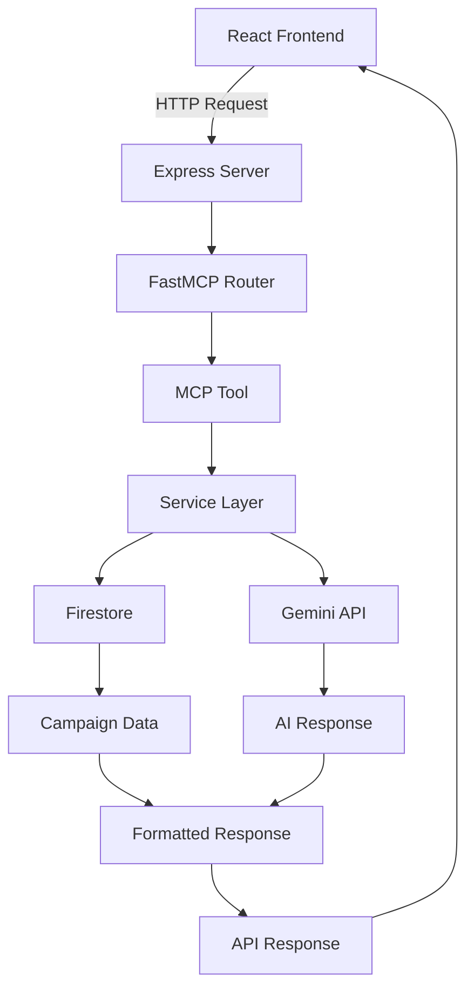

# MVP Site TypeScript Migration Engineering Design

## Table of Contents
1. [Engineering Goals](#engineering-goals)
2. [Engineering Tenets](#engineering-tenets)
3. [Technical Overview](#technical-overview)
4. [System Design](#system-design)
5. [Quality Assurance](#quality-assurance)
6. [Testing Strategy](#testing-strategy)
7. [Risk Assessment](#risk-assessment)
8. [Decision Records](#decision-records)
9. [Rollout Plan](#rollout-plan)
10. [Monitoring & Success Metrics](#monitoring--success-metrics)
11. [Automation Hooks](#automation-hooks)

## Engineering Goals

### Primary Engineering Goals
- **Goal 1**: Achieve 100% functional parity with Python Flask implementation (measured by identical API responses)
- **Goal 2**: Establish TypeScript MCP server architecture following ai_universe patterns (target: ≤200ms response time)
- **Goal 3**: Maintain complete Firestore schema compatibility (zero data migration required)

### Secondary Engineering Goals
- **Code Maintainability**: Improve developer experience with TypeScript type safety and modern tooling
- **Performance Optimization**: Leverage Node.js async capabilities for improved AI/LLM operation throughput
- **Architecture Modernization**: Implement proven MCP patterns for future AI tool extensibility

## Engineering Tenets

### Core Principles
1. **Reliability First**: Prefer proven solutions over cutting-edge approaches; follow ai_universe reference architecture
2. **100% Compatibility**: Every API endpoint must produce identical responses to Python implementation
3. **Testability**: All code must be testable with comprehensive side-by-side validation
4. **Observability**: Instrument everything for debugging migration issues and performance analysis
5. **Zero Disruption**: Migration must be transparent to frontend and end users
6. **Solo Developer Sustainability**: Manage complexity to prevent developer burnout and knowledge silos (expert recommendation)

### Quality Standards
- **Bug Analysis**: All migration issues must use systematic debugging approach
- **Test-Driven Validation**: Use comparative testing between Python and TypeScript implementations
- **No Untested Paths**: 100% code coverage for critical campaign and interaction flows
- **Performance Benchmarking**: All endpoints must meet or exceed Python baseline performance
- **Complexity Management**: Keep individual components simple, avoid over-abstraction (addresses expert concerns)
- **Documentation First**: Extensive documentation to prevent knowledge silos for solo developer

## Technical Overview

### Architecture Approach
**Complete Rewrite Strategy**: Full Python-to-TypeScript conversion using ai_universe MCP server patterns, maintaining strict API compatibility through comprehensive validation testing.

**Risk Acknowledgment**: Expert analysis identified this as high-risk for solo developer. Mitigation through rigorous TDD, extensive side-by-side testing, and complexity management strategies.

### Technology Choices
- **Server Framework**: Express.js with FastMCP integration using ai_universe proven patterns
- **Shared Utilities**: `@ai-universe/mcp-server-utils` for reusable FastMCP components (from PR #90)
- **Server Factory**: `createFastMCPServer()` pattern for standardized server setup
- **Type System**: TypeScript with strict configuration and Zod schema validation
- **Database**: Firebase Firestore with existing schema preservation
- **Authentication**: Firebase Admin SDK with identical token validation logic
- **AI Integration**: Gemini API with TypeScript SDK replacing Python SDK
- **Testing**: Jest with custom comparative testing framework

### Integration Points
- **Frontend Compatibility**: Preserve exact API contract with existing React frontend_v2
- **Database Migration**: Zero-downtime transition maintaining all existing Firestore documents
- **Authentication Flow**: Identical Firebase Auth integration preserving user sessions
- **Export System**: Maintain all document export formats and file handling patterns

## System Design

### Component Architecture

```typescript
// Core MCP Server Structure (following ai_universe PR #90 pattern)
src/
├── server.ts              // HTTP server with FastMCP proxy integration
├── stdio-server.ts        // stdio server entrypoint
├── createFastMCPServer.ts // Reusable FastMCP server factory (ai_universe pattern)
├── tools/                 // MCP tool implementations
│   ├── CampaignTool.ts    // Campaign management operations
│   ├── InteractionTool.ts // AI interaction processing
│   ├── ExportTool.ts      // Document export functionality
│   └── SettingsTool.ts    // User settings management
├── services/              // Business logic services
│   ├── FirestoreService.ts // Database operations
│   ├── GeminiService.ts   // AI/LLM integration
│   ├── AuthService.ts     // Authentication handling
│   └── ValidationService.ts // Request/response validation
├── types/                 // TypeScript type definitions
│   ├── Campaign.ts        // Campaign-related types
│   ├── GameState.ts       // Game state type definitions
│   └── API.ts             // API contract types
└── utils/                 // Utility functions (supplement @ai-universe/mcp-server-utils)
    ├── logger.ts          // Logging infrastructure
    ├── errors.ts          // Error handling utilities
    └── validation.ts      // Input validation helpers

// External Dependencies
@ai-universe/mcp-server-utils/
├── createWildcardCorsOptions  // CORS configuration utility
├── startFastMcpHttpProxy     // HTTP proxy for FastMCP integration
├── findAvailablePort         // Port management utility
└── wildcardToSafeRegex      // Security utility for regex patterns
```

### Data Flow Diagram



### API Design

#### Endpoint Preservation Strategy
All existing Python Flask endpoints must be exactly replicated:

```typescript
// Critical API Endpoints (exact compatibility required)
GET    /api/campaigns              // List user campaigns
GET    /api/campaigns/:id          // Get campaign details
POST   /api/campaigns              // Create new campaign
PATCH  /api/campaigns/:id          // Update campaign
POST   /api/campaigns/:id/interaction // Process user interaction
GET    /api/campaigns/:id/export   // Export campaign documents
GET    /api/settings               // Get user settings
POST   /api/settings               // Update user settings
GET    /api/time                   // Server time synchronization
```

#### Request/Response Schema Validation
```typescript
// Example: Campaign interaction endpoint schema
const InteractionRequestSchema = z.object({
  user_input: z.string(),
  mode: z.enum(['character', 'exploration', 'combat']).default('character'),
});

const InteractionResponseSchema = z.object({
  success: z.boolean(),
  narrative: z.string(),
  response: z.string(), // Backward compatibility field
  story: z.array(z.object({
    text: z.string(),
    actor: z.string(),
    timestamp: z.number(),
    // Additional structured fields preserved exactly
  })),
  game_state: z.record(z.any()), // Preserve flexible game state structure
});
```

### Database Design

#### Schema Compatibility Strategy
**Zero Migration Approach**: TypeScript implementation must work with existing Firestore schema without any document structure changes.

```typescript
// Firestore Document Types (matching Python implementation exactly)
interface CampaignDocument {
  title: string;
  user_id: string;
  created_at: FirebaseFirestore.Timestamp;
  last_played: FirebaseFirestore.Timestamp;
  character: string;
  setting: string;
  description: string;
  custom_options: string[];
  selected_prompts: string[];
  // All other fields preserved exactly as in Python
}

interface StoryEntry {
  text: string;
  actor: 'user' | 'gemini';
  timestamp: number;
  mode: string;
  // Structured fields preserved exactly
  god_mode_response?: string;
  resources?: Record<string, any>;
  dice_rolls?: any[];
  // All Python fields maintained
}
```

#### Performance Considerations
- **Connection Pooling**: Optimize Firestore connection management for Node.js
- **Query Optimization**: Preserve existing query patterns while optimizing for TypeScript async patterns
- **Batch Operations**: Maintain existing batch write patterns for complex game state updates

## Implementation Plan

### Phase 1: Foundation Setup (Estimated: 4-6 hours)
**Core Infrastructure**
- FastMCP server initialization with Express integration
- TypeScript configuration matching ai_universe standards
- Firebase Admin SDK integration with identical auth patterns
- Basic logging and error handling infrastructure
- Development environment setup with hot reloading

### Phase 2: Service Layer Migration (Estimated: 8-12 hours)
**Business Logic Translation**
- FirestoreService: Translate all Python Firestore operations to TypeScript
- GeminiService: Migrate AI integration from Python SDK to TypeScript
- AuthService: Replicate Firebase Auth validation logic exactly
- ValidationService: Implement comprehensive request/response validation

### Phase 3: MCP Tool Implementation (Estimated: 10-15 hours)
**API Endpoint Migration**
- CampaignTool: All campaign CRUD operations
- InteractionTool: AI interaction processing with identical response formatting
- ExportTool: Document generation and file serving
- SettingsTool: User settings management

### Phase 4: Testing & Validation (Estimated: 6-10 hours)
**Comprehensive Validation**
- Unit tests for all service layer components
- Integration tests for complete API workflows
- Side-by-side comparison testing framework
- Performance benchmarking against Python baseline

### Phase 5: Migration Validation (Estimated: 4-6 hours)
**Production Readiness**
- Side-by-side testing with production traffic mirroring
- Performance validation under load
- Security audit and penetration testing
- Documentation and deployment preparation

**Total Estimated Timeline: 32-49 hours** *(Expert Warning: May significantly exceed estimates for solo developer)*

## Risk Assessment

### Expert Analysis Integration
**External consultations (Gemini Pro + Perplexity) identified this approach as high-risk for solo MVP development, citing complexity vs speed trade-offs and maintenance burden concerns. Proceeding with enhanced risk mitigation strategies.**

### Technical Risks

#### Critical Risk Issues (From Expert Analysis)
- **Risk**: Complete rewrite complexity overwhelming solo developer capacity
- **Mitigation**: Rigorous TDD approach with ~100-line commits, comprehensive side-by-side testing framework, weekly milestone reviews
- **Monitoring**: Daily progress tracking, milestone completion metrics, developer fatigue indicators, scope creep detection

- **Risk**: Custom FastMCP framework creating maintenance burden and knowledge silo
- **Mitigation**: Extensive documentation, code comments explaining MCP patterns, fallback to standard Express patterns, community resource identification
- **Monitoring**: Framework issue tracking, community support availability, alternative implementation paths

- **Risk**: Migration timeline significantly exceeding estimates (expert concern: months vs weeks)
- **Mitigation**: Conservative time estimates with 2x buffer, weekly milestone reviews, scope reduction readiness, rollback plan
- **Monitoring**: Velocity tracking, blocked task identification, actual vs estimated time analysis

#### High Risk Issues
- **Risk**: Subtle differences in Firestore SDK behavior between Python and TypeScript
- **Mitigation**: Comprehensive integration testing with identical test data sets, field-by-field comparison validation
- **Monitoring**: Automated comparison of database operation results, data integrity validation

- **Risk**: Gemini API response differences between Python and TypeScript SDKs
- **Mitigation**: Side-by-side API call comparison with identical prompts, response normalization, SDK version tracking
- **Monitoring**: Response content hash comparison for identical inputs, API response format validation

#### Medium Risk Issues
- **Risk**: TypeScript async/await patterns causing different execution timing
- **Mitigation**: Careful Promise handling and sequential processing where order matters
- **Monitoring**: Request/response timing analysis and race condition detection

- **Risk**: Node.js memory management differences affecting long-running processes
- **Mitigation**: Comprehensive memory profiling and garbage collection optimization
- **Monitoring**: Memory usage metrics and leak detection

#### Low Risk Issues
- **Risk**: Express middleware order causing request processing differences
- **Mitigation**: Exact replication of Flask middleware patterns
- **Monitoring**: Request flow logging and middleware execution tracing

### Dependencies & Blockers
- **External API Dependencies**: Gemini API availability and rate limits
- **Database Dependencies**: Firestore regional availability and performance
- **Development Dependencies**: ai_universe reference architecture access
- **Testing Dependencies**: Production data access for comprehensive validation

## Decision Records

### Architecture Decisions

**Decision**: Use FastMCP + Express instead of pure Express
**Date**: 2025-09-29
**Context**: Need MCP compliance for future AI tool integration while maintaining REST API compatibility
**Options**:
1. Pure Express with custom routing
2. FastMCP with Express integration
3. NestJS with MCP adapter
**Rationale**: FastMCP provides proven MCP patterns from ai_universe while maintaining Express compatibility for existing API contracts
**Consequences**: Additional abstraction layer but future-proof architecture for AI tool expansion
**Review Date**: Post-migration performance analysis

**Decision**: Zero-migration database strategy
**Date**: 2025-09-29
**Context**: Minimize migration risk and maintain data integrity
**Options**:
1. Schema migration with data transformation
2. Dual-write during transition period
3. Zero-migration with schema compatibility
**Rationale**: Eliminates data migration risks and reduces complexity
**Consequences**: TypeScript types must accommodate all existing schema variations
**Review Date**: After successful production deployment

### Technology Choices
- **TypeScript over JavaScript**: Type safety critical for complex game state management
- **Jest over Mocha**: Better TypeScript integration and snapshot testing capabilities
- **Zod over Joi**: Better TypeScript integration and runtime type validation
- **Winston over console**: Structured logging compatible with existing log analysis tools

## Quality Assurance

### Mandatory Practices
- **Migration Validation**: All responses must pass side-by-side comparison with Python implementation
- **Test-Driven Migration**: Write tests before implementing each component
- **Performance Benchmarking**: Every endpoint must meet Python baseline performance
- **Code Review**: Senior review required for all database and authentication code

### Development Standards
- **No Code Without Tests**: 100% test coverage for critical paths
- **Performance Baselines**: Automated performance regression testing
- **Security Review**: Authentication and authorization code security audit
- **Documentation**: API documentation must match Python implementation exactly

## Testing Strategy

### Comparative Testing Framework
```typescript
// Side-by-side validation testing
describe('Campaign API Compatibility', () => {
  test('identical response structure', async () => {
    const pythonResponse = await callPythonAPI('/api/campaigns', payload);
    const typescriptResponse = await callTypescriptAPI('/api/campaigns', payload);

    expect(normalizeResponse(typescriptResponse)).toEqual(
      normalizeResponse(pythonResponse)
    );
  });
});
```

### Test Categories

#### Unit Tests
- **Service Layer**: All business logic components with mocked dependencies
- **Utility Functions**: All helper functions with edge case coverage
- **Type Validation**: Zod schema validation with malformed input testing
- **Error Handling**: All error conditions and edge cases

#### Integration Tests
- **Database Operations**: Firestore integration with real test database
- **AI API Integration**: Gemini API calls with test prompts and response validation
- **Authentication Flow**: Firebase Auth integration with test tokens
- **End-to-End Workflows**: Complete user journey testing

#### Comparative Tests
- **API Response Validation**: Side-by-side comparison of all endpoints
- **Performance Benchmarking**: Response time comparison under identical conditions
- **Error Handling Parity**: Identical error responses for all failure scenarios
- **Edge Case Behavior**: Unusual input handling comparison

## Rollout Plan

### Pre-Deployment Phase
1. **Development Environment**: Complete TypeScript implementation with full test coverage
2. **Staging Validation**: Deploy to staging environment with production data snapshot
3. **Performance Testing**: Load testing to validate performance targets
4. **Security Audit**: Comprehensive security review of authentication and data handling

### Deployment Strategy
1. **Parallel Deployment**: Deploy TypeScript server alongside existing Python server
2. **Traffic Mirroring**: Route copy of production traffic to TypeScript server for validation
3. **Gradual Cutover**: Percentage-based traffic routing from 1% to 100% over 24-48 hours
4. **Monitoring & Rollback**: Real-time monitoring with automatic rollback triggers

### Post-Deployment Phase
1. **Performance Monitoring**: 48-hour intensive monitoring of all metrics
2. **User Feedback Collection**: Monitoring for user-reported issues
3. **Python Server Decommission**: Gradual shutdown of Python infrastructure
4. **Documentation Updates**: Update all operational documentation

## Monitoring & Success Metrics

### Real-Time Monitoring
- **API Response Times**: P50, P95, P99 response time percentiles
- **Error Rates**: 4xx and 5xx error rates by endpoint
- **Database Performance**: Firestore operation latency and error rates
- **Memory & CPU Usage**: Server resource utilization patterns
- **Authentication Success Rate**: Firebase auth validation success percentage

### Comparative Analysis
- **Response Similarity**: Percentage of identical responses in side-by-side testing
- **Performance Delta**: Response time difference compared to Python baseline
- **Error Rate Comparison**: Error rate difference between implementations
- **User Experience Impact**: User-reported issues and satisfaction metrics

### Business Metrics
- **Service Availability**: Uptime percentage during and after migration
- **User Retention**: User activity levels before/after migration
- **Support Ticket Volume**: Migration-related support requests
- **Feature Development Velocity**: Time to implement new features post-migration

## Automation Hooks

### CI/CD Integration
- **Automated Testing**: All tests run on every commit with comparative validation
- **Performance Regression Detection**: Automated performance baseline comparison
- **Security Scanning**: Automated security vulnerability scanning
- **Deployment Automation**: Automated staging deployment and production promotion

### Quality Gates
- **Pre-commit Hooks**: TypeScript compilation, linting, and basic test validation
- **Pull Request Validation**: Comprehensive test suite and comparative testing
- **Deployment Gates**: Performance and security validation before production deployment
- **Rollback Automation**: Automated rollback triggers based on error rate thresholds

### Monitoring Automation
- **Alert Configuration**: Automated alerting for performance degradation or errors
- **Dashboard Updates**: Real-time dashboard updates for migration progress
- **Report Generation**: Automated daily migration progress and health reports
- **Capacity Planning**: Automated resource usage analysis and scaling recommendations
