# MCP Smoke Tests

Comprehensive smoke testing for the WorldArchitect.AI MCP (Model Context Protocol) server.

## Overview

The MCP smoke tests validate critical D&D campaign functionality through the MCP JSON-RPC 2.0 interface:

- **Health endpoint** - Verify service availability
- **Tools discovery** - Confirm all 8 D&D campaign tools are exposed
- **Campaign creation** - Test AI story generation
- **Gameplay actions** - Validate dice mechanics and state management
- **Error handling** - Ensure proper error responses for invalid inputs

## Test Modes

### Mock Mode (Default)
Uses pre-defined mock responses for fast CI/CD validation. No external API calls.

```bash
# Run locally
MCP_TEST_MODE=mock node scripts/mcp-smoke-tests.mjs

# Or simply
node scripts/mcp-smoke-tests.mjs
```

**Use for:**
- Local development
- Fast CI validation
- Testing error handling logic

### Real Mode
Hits actual deployed servers for end-to-end validation.

```bash
# Against specific server
MCP_SERVER_URL=https://your-server.com MCP_TEST_MODE=real node scripts/mcp-smoke-tests.mjs
```

**Use for:**
- Preview deployment validation
- Production smoke tests
- Integration testing

## GitHub Actions Workflows

### 1. Mock Smoke Tests (Automatic)
**File:** `.github/workflows/mcp-smoke-tests.yml`
**Trigger:** Automatic on PR (when MCP files change)

Runs mock tests in CI for fast feedback without API calls.

### 2. Real API Smoke Tests
**File:** `.github/workflows/manual-mcp-smoke-tests.yml`
**Trigger:** `/smoke` comment on PR
**Status:** ⚠️ CONFLICTS with new preview workflow (both use `/smoke`)

Tests against production APIs (Gemini + Firebase) for full integration validation.

**Note:** This workflow will conflict with the new preview server workflow. Consider:
- Renaming this trigger to `/smoke-real` for production API testing
- Or disabling this workflow in favor of preview server testing

### 3. Preview Server Smoke Tests (NEW) ✅
**File:** `.github/workflows/mcp-preview-smoke-tests.yml`
**Trigger:** `/smoke` comment on PR

Tests deployed GCP Cloud Run preview instances for PR validation. This is the recommended workflow for testing preview deployments.

```
/smoke
```

**Why this is better:**
- Tests the actual deployed preview server (real Cloud Run environment)
- Validates the full deployment stack (Docker, Secret Manager, Cloud Run)
- No local API key management needed
- Matches production architecture exactly

## Test Coverage

### 1. Health Check
Validates the `/health` endpoint returns:
```json
{
  "status": "healthy",
  "timestamp": "2024-11-18T07:00:00Z",
  "service": "worldarchitect-ai"
}
```

### 2. Tools List
Confirms all 8 MCP tools are available:
- `create_campaign` - Create new D&D campaign
- `get_campaign_state` - Retrieve campaign state
- `process_action` - Execute gameplay action
- `update_campaign` - Modify campaign settings
- `export_campaign` - Export campaign data
- `get_campaigns_list` - List user campaigns
- `get_user_settings` - Get user preferences
- `update_user_settings` - Update user preferences

### 3. Campaign Creation
Creates a test campaign and validates:
- ✅ Campaign ID generated
- ✅ AI-generated opening story
- ✅ D&D 5E character data initialized
- ✅ World state properly set up

Example request:
```json
{
  "jsonrpc": "2.0",
  "method": "tools/call",
  "params": {
    "name": "create_campaign",
    "arguments": {
      "user_id": "smoke-test-12345",
      "title": "Smoke Test Campaign",
      "player_name": "Test Hero",
      "player_class": "Fighter",
      "campaign_setting": "Test dungeon",
      "debug_mode": true
    }
  },
  "id": 1
}
```

### 4. Gameplay Action
Executes a player action and validates:
- ✅ Narrative response
- ✅ Dice roll mechanics (d20 + modifiers)
- ✅ DC checks
- ✅ State updates

Example request:
```json
{
  "jsonrpc": "2.0",
  "method": "tools/call",
  "params": {
    "name": "process_action",
    "arguments": {
      "user_id": "smoke-test-12345",
      "campaign_id": "abc123",
      "user_input": "I search for clues in the room.",
      "debug_mode": true
    }
  },
  "id": 2
}
```

### 5. Error Handling
Validates proper error responses:

**Invalid Campaign ID:**
```json
{
  "jsonrpc": "2.0",
  "id": 3,
  "result": {
    "error": "Campaign not found",
    "status_code": 404
  }
}
```

**Missing Required Parameters:**
```json
{
  "jsonrpc": "2.0",
  "id": 4,
  "result": {
    "error": "Campaign ID is required"
  }
}
```

## Configuration

Environment variables:

| Variable | Default | Description |
|----------|---------|-------------|
| `MCP_SERVER_URL` | (required for real mode) | Base URL of MCP server |
| `MCP_TEST_MODE` | `mock` | Test mode: `mock` or `real` |
| `MCP_TEST_TIMEOUT_MS` | `60000` | Request timeout (60 seconds) |
| `MCP_TEST_MAX_ATTEMPTS` | `3` | Number of retry attempts |
| `MCP_TEST_RETRY_DELAY_MS` | `2000` | Delay between retries |

## Output

### Console Output
Real-time test progress with emojis:
```
🔍 Checking health endpoint at https://server.com/health
✅ Health endpoint returned healthy status

🔍 Testing tools/list endpoint
✅ tools/list returned 8 tools including all required ones

🔍 Testing campaign creation via create_campaign tool
✅ Campaign created: 6er2SfmDCEcvvXSyLVcA

🔍 Testing gameplay action via process_action tool
✅ Gameplay action completed with 1 dice roll(s)

🔍 Testing error handling for invalid inputs
✅ Invalid campaign ID properly returns error
✅ Missing required parameters properly returns error

========================================
✅ ALL SMOKE TESTS PASSED
========================================
```

### Log Files
Automatically saved to `/tmp/<repo>/<branch>/smoke_tests/`:
- `mcp_output.log` - Full console output
- `test_results.json` - Structured test results

Example `test_results.json`:
```json
{
  "status": "success",
  "mode": "real",
  "timestamp": "2024-11-18T07:30:00Z",
  "logs": [
    {
      "timestamp": "2024-11-18T07:30:01Z",
      "kind": "step",
      "message": "Checking health endpoint..."
    },
    {
      "timestamp": "2024-11-18T07:30:02Z",
      "kind": "campaign-created",
      "campaign_id": "6er2SfmDCEcvvXSyLVcA",
      "title": "Smoke Test Campaign"
    }
  ]
}
```

## Development

### Adding New Tests

1. **Define test function** in `scripts/mcp-smoke-tests.mjs`:
```javascript
async function testNewFeature() {
  logStep('Testing new feature');

  const payload = await callRpc(
    'tools/call',
    {
      name: 'new_tool',
      arguments: { /* ... */ }
    }
  );

  if (payload?.error) {
    throw new Error(`new_tool failed: ${JSON.stringify(payload.error)}`);
  }

  logInfo('✅ New feature test passed');
  return payload;
}
```

2. **Add mock response** (if needed):
```javascript
if (toolName === 'new_tool') {
  return {
    jsonrpc: '2.0',
    id,
    result: { success: true, data: '...' }
  };
}
```

3. **Call from main**:
```javascript
await testNewFeature();
```

### Debugging Failed Tests

1. **Check console output** for specific failure point
2. **Review log files** in `/tmp/<repo>/<branch>/smoke_tests/`
3. **Test manually** with curl:
```bash
# Health check
curl https://server.com/health

# Tools list
curl -X POST https://server.com/mcp \
  -H "Content-Type: application/json" \
  -d '{"jsonrpc":"2.0","method":"tools/list","params":{},"id":1}'
```

4. **Enable verbose logging**:
```bash
MCP_TEST_TIMEOUT_MS=120000 node scripts/mcp-smoke-tests.mjs
```

## Integration with CI/CD

### PR Preview Flow

```mermaid
graph LR
    A[Push to PR] --> B[Preview Deploys]
    B --> C[Comment /smoke]
    C --> D[Run Smoke Tests]
    D --> E{Tests Pass?}
    E -->|Yes| F[✅ PR Comment]
    E -->|No| G[❌ PR Comment]
```


### Benefits
- ✅ **Fast feedback** - Know if preview deployment works
- ✅ **Automated validation** - No manual testing required
- ✅ **Confidence** - Proven working before merge
- ✅ **Evidence** - Artifacts for debugging

## Comparison with Other Tests

| Test Type | Purpose | When to Run | API Calls |
|-----------|---------|-------------|-----------|
| **Mock Smoke Tests** | Fast validation | Every PR (automatic) | None (mocked) |
| **Real API Smoke Tests** | Integration test | On-demand (`/smoke`) | Production APIs |
| **Preview Smoke Tests** | Deployment validation | On-demand (`/smoke`) | Preview server |
| **Unit Tests** | Code correctness | Every commit | None (mocked) |
| **Integration Tests** | Multi-service | Pre-production | Staging APIs |

## Example: PR #2045 Validation

From the GCP preview server deployment validation:

```bash
# 1. Preview deployed to Cloud Run
SERVICE_URL=https://mvp-site-app-pr-2045-i6xf2p72ka-uc.a.run.app

# 2. Manual validation
curl $SERVICE_URL/health
# ✅ {"status":"healthy"}

curl -X POST $SERVICE_URL/mcp \
  -H "Content-Type: application/json" \
  -d '{"jsonrpc":"2.0","method":"tools/list","params":{},"id":1}'
# ✅ 8 tools returned

# 3. Automated smoke tests
MCP_SERVER_URL=$SERVICE_URL MCP_TEST_MODE=real node scripts/mcp-smoke-tests.mjs
# ✅ ALL SMOKE TESTS PASSED

# 4. Campaign creation + gameplay validated
# ✅ Campaign ID: 6er2SfmDCEcvvXSyLVcA
# ✅ Dice roll: 1d20+5 = 17 (Success!)
```

## Troubleshooting

### Common Issues

**Issue:** `MCP_SERVER_URL environment variable must be provided`
**Fix:** Set the server URL:
```bash
export MCP_SERVER_URL=https://your-server.com
```

**Issue:** Tests timeout
**Fix:** Increase timeout:
```bash
MCP_TEST_TIMEOUT_MS=120000 node scripts/mcp-smoke-tests.mjs
```

**Issue:** Preview not found in GCP
**Fix:** Wait for preview to deploy or trigger new deployment

**Issue:** Campaign creation fails with API key error
**Fix:** Ensure Secret Manager is configured (see PR #2045)

## Related Documentation

- [Manual Smoke Tests README](../.github/workflows/README.md) - Workflow documentation
- [MCP Server Implementation](../mvp_site/mcp_api.py) - Server code
- [PR #2045](https://github.com/jleechanorg/worldarchitect.ai/pull/2045) - GCP preview implementation

## Credits

Inspired by [ai_universe MCP smoke tests](https://github.com/jleechanorg/ai_universe/blob/main/scripts/mcp-ci-tests.mjs) with adaptations for D&D campaign mechanics.
